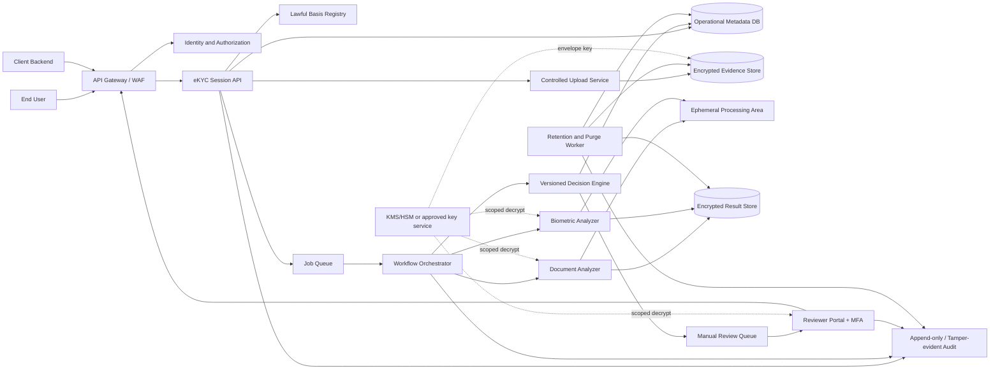
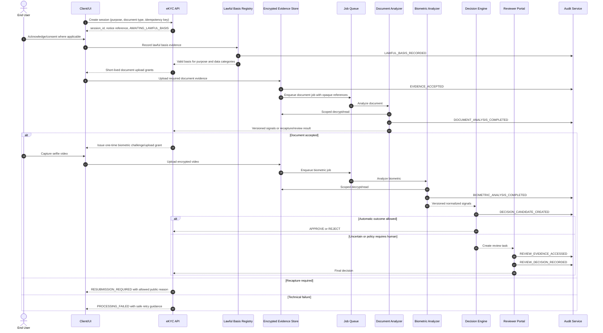
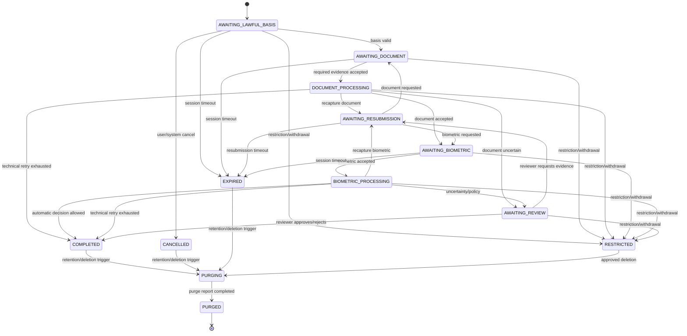

# Tài liệu thiết kế luồng eKYC v2

| Thuộc tính | Giá trị |
|---|---|
| Trạng thái | Draft để Architecture, Engineering, Security, Legal/DPO và Product review |
| Phạm vi | Luồng eKYC nội bộ hỗ trợ CCCD và trang dữ liệu cá nhân hộ chiếu ICAO TD3 |
| Tài liệu nguồn | [Checklist bảo mật và tuân thủ](./EKYC_SECURITY_COMPLIANCE_CHECKLIST.md), [Kế hoạch migration v2](./EKYC_V2_MIGRATION_PLAN.md) |
| Đối tượng đọc | Product, Backend, Frontend, AI/ML, QA, DevOps/SRE, Security, Legal/DPO, Risk Officer |

> Tài liệu này là thiết kế kỹ thuật và nghiệp vụ, không phải ý kiến pháp lý.
> Các nội dung về lawful basis, retention, data residency và quyền của chủ thể dữ
> liệu chỉ trở thành cấu hình vận hành sau khi được Legal/DPO phê duyệt.

## 1. Mục tiêu thiết kế

Thiết kế một luồng eKYC có thể:

- Xác minh giấy tờ CCCD và hộ chiếu theo pipeline trung lập với loại giấy tờ.
- Kiểm tra chất lượng ảnh, OCR/MRZ, khuôn mặt, liveness và các tín hiệu giả mạo.
- Tự động thông qua hoặc từ chối chỉ khi policy đã phê duyệt cho phép; trường hợp
  không chắc chắn phải chuyển manual review.
- Không dùng LLM làm công cụ OCR, trích xuất trường hoặc nguồn đề xuất quyết định.
- Không xử lý dữ liệu thật nếu thiếu lawful-basis record, mã hóa, xác thực, phân
  quyền hoặc audit bắt buộc.
- Giảm tối đa dữ liệu nhạy cảm được lưu và xóa được toàn bộ dữ liệu theo một purge
  workflow có kiểm chứng.
- Ghi lại đủ phiên bản policy, rule, model và bằng chứng audit để giải thích một
  quyết định mà không đưa PII vào application log.

## 2. Nguyên tắc bắt buộc

1. **Compliance before collection:** server chỉ cấp quyền upload sau khi đã có
   lawful-basis record hợp lệ cho đúng controller, purpose, loại dữ liệu và phiên
   bản notice.
2. **Fail closed:** thiếu hoặc lỗi encryption key, workload identity, authorization
   hay audit bắt buộc đều phải dừng thao tác nhạy cảm; không fallback sang plaintext
   hoặc bỏ qua audit.
3. **Một nguồn dữ liệu nhạy cảm được mã hóa:** bảng vận hành chỉ lưu ID, trạng thái,
   hash, timestamp và version tối thiểu. Raw evidence và kết quả đầy đủ nằm trong
   encrypted evidence store.
4. **Ephemeral by default:** raw OCR, face crop, embedding, audio, transcript và
   kết quả trung gian mặc định chỉ tồn tại trong thời gian xử lý.
5. **Document-neutral core:** orchestration, biometric và decision engine không phụ
   thuộc CCCD hay Passport. Logic riêng nằm trong adapter/parser có version.
6. **Confidence-aware:** mọi kết quả tự động có confidence, reason code, rule/model
   version và ngưỡng được áp dụng.
7. **Human review for uncertainty:** low confidence, xung đột trường, tín hiệu mô
   hình không kết luận được hoặc lỗi check digit phải đi manual review hoặc yêu cầu
   thu thập lại theo policy.
8. **Không tuyên bố quá mức:** OCR được chữ không đồng nghĩa xác thực giấy tờ; face
   detector hoạt động không đồng nghĩa face matching đã đạt chuẩn; chưa hỗ trợ
   NFC/chip hoặc kiểm tra với cơ sở dữ liệu nhà nước nếu chưa có tích hợp tương ứng.

## 3. Phạm vi

### 3.1 Trong phạm vi

- Tạo và quản lý phiên eKYC.
- Hiển thị notice và ghi nhận lawful basis/consent evidence.
- Thu thập đúng số lượng ảnh theo loại giấy tờ:
  - CCCD: mặt trước và mặt sau theo thiết kế được phê duyệt.
  - Passport: chỉ trang dữ liệu cá nhân ICAO TD3 trong MVP.
- Kiểm tra định dạng, kích thước, malware và chất lượng ảnh.
- OCR và parser/validator theo rule có version.
- Passport theo hướng MRZ-first: phát hiện MRZ, OCR hai dòng 44 ký tự, parse và
  kiểm tra check digit, sau đó đối chiếu visible zone.
- Trích xuất khuôn mặt trên giấy tờ.
- Thu video selfie và thực hiện face matching, liveness/deepfake; voice spoofing
  chỉ bật khi mục đích, dữ liệu audio và benchmark đã được phê duyệt.
- Tổng hợp risk signal, ra quyết định tự động theo policy hoặc chuyển manual review.
- Audit, retention, data-subject workflow và purge end-to-end.

### 3.2 Ngoài phạm vi MVP

- Đọc hoặc xác thực NFC/chip hộ chiếu.
- Đối soát với C06, cơ sở dữ liệu quốc gia hoặc watchlist bên ngoài khi chưa có
  tích hợp và căn cứ xử lý được phê duyệt.
- Tuyên bố xác thực tính thật của giấy tờ chỉ dựa vào OCR, MRZ hoặc ảnh chụp.
- Hỗ trợ mọi loại hộ chiếu/quốc gia ngoài danh sách release đã benchmark.
- Lưu face embedding dài hạn nếu chưa có mục đích và retention được phê duyệt.
- Dùng LLM để OCR, trích xuất trường, review hoặc ra quyết định.

## 4. Vai trò và quyền hạn

| Vai trò | Trách nhiệm chính | Quyền tối thiểu |
|---|---|---|
| End User | Cung cấp lawful-basis evidence, giấy tờ và video; xem trạng thái của chính mình | Create session, upload đúng session, xem kết quả công khai đã rút gọn |
| Client/Channel Backend | Khởi tạo phiên và điều phối UI cho người dùng | `session:create`, `session:read`, `evidence:upload` theo tenant/purpose |
| Orchestrator | Điều phối workflow và cập nhật trạng thái | Gọi analyzer, tạo job, đọc/ghi metadata; không mặc định có quyền export |
| AI Analyzer | Phân tích evidence trong phạm vi job | `analyze`; quyền giải mã ngắn hạn đúng object/job |
| Decision Engine | Áp dụng policy đã phê duyệt | Đọc signal chuẩn hóa, ghi decision candidate |
| Risk Officer/Reviewer | Xử lý hồ sơ cần review | `review:read`, `decrypt:approved-fields`, `review:decide`; bắt buộc MFA |
| Security/Compliance Auditor | Kiểm tra control evidence và audit | Đọc audit đã kiểm soát; không mặc định xem raw evidence |
| Data Subject Operations | Xử lý access/correction/restriction/deletion | Scope riêng theo ticket đã xác thực |
| System Administrator | Vận hành hạ tầng | Không mặc định có quyền giải mã PII |
| Purge Worker | Xóa dữ liệu theo retention/yêu cầu hợp lệ | `delete` theo manifest; không có quyền export hoặc review |

Các quyền `analyze`, `decrypt`, `review`, `export`, `correct` và `delete` phải tách
riêng. Không dùng shared internal API key làm danh tính chung cho các service.

## 5. Kiến trúc logic



### 5.1 Ranh giới dữ liệu

- Public/client zone chỉ nhận file qua upload token ngắn hạn, ràng buộc session,
  evidence type, content type, kích thước và thời gian hết hạn.
- AI service nằm trong private network. Mọi service-to-service call dùng mTLS hoặc
  workload identity/token ngắn hạn có audience và scope.
- Queue chỉ chứa opaque ID, job type và metadata không nhạy cảm; không chứa ảnh,
  raw OCR, transcript hoặc PII.
- Temporary processing area phải được mã hóa, không shared ngoài job, có TTL và
  được dọn cả khi thành công, thất bại hoặc worker bị ngắt.
- Telemetry chỉ chứa ID ngẫu nhiên, state, duration, outcome và reason code đã
  allowlist; không chứa request body hoặc PII.

## 6. Luồng eKYC end-to-end

### 6.1 Điều kiện hệ thống sẵn sàng

Trước khi nhận phiên có dữ liệu thật, hệ thống kiểm tra:

- Encryption/KMS khả dụng và workload có quyền tối thiểu cần thiết.
- Audit sink bắt buộc khả dụng.
- Authentication/authorization và policy version đã load thành công.
- Notice/lawful-basis configuration và retention policy đã được phê duyệt.
- Model, rule và dependency có version/digest nằm trong allowlist.

Service có thể trả `live=true` để phục vụ chẩn đoán nhưng phải trả `ready=false`
và từ chối endpoint nhạy cảm nếu một điều kiện bắt buộc chưa đạt.

### 6.2 Bước A — Khởi tạo phiên

1. Client backend gọi tạo phiên với `purpose_code`, `subject_ref` dạng opaque,
   locale và idempotency key. `requested_document_type` là ràng buộc tùy chọn từ
   hệ thống tích hợp; UI người dùng có thể chọn nhóm giấy tờ sau khi claim phiên.
2. Server xác thực workload, tenant, purpose và, nếu có, loại giấy tờ được yêu cầu
   có nằm trong release hiện tại hay không.
3. Server tạo `session_id` ngẫu nhiên, `expires_at`, policy version và trạng thái
   `AWAITING_LAWFUL_BASIS`.
4. Response không chứa PII và không cấp upload token ở bước này.

### 6.3 Bước B — Notice và lawful basis

1. UI tải notice đúng controller, purpose, loại dữ liệu, locale và version.
2. Người dùng được thông báo trước khi thu thập giấy tờ/sinh trắc học.
3. Server ghi một lawful-basis record bất biến gồm:
   - loại căn cứ do Legal/DPO cấu hình;
   - notice/consent version và ngôn ngữ;
   - controller, purpose, data categories;
   - subject/session, timestamp và channel;
   - bằng chứng hành động khi consent là căn cứ áp dụng.
4. Server xác nhận record còn hiệu lực và bao phủ đúng mục đích của session.
5. Session chuyển sang `AWAITING_DOCUMENT`.

Client chỉ gửi bằng chứng về hành động/notice đã hiển thị; client không được tự chọn
hoặc thay đổi `basis_type`. Server ánh xạ basis từ purpose configuration đã được
Legal/DPO phê duyệt.

Nếu thiếu hoặc không hợp lệ, server trả reason code và không cấp upload token.
Withdrawal không mặc định đồng nghĩa xóa ngay; hệ thống tạo workflow restriction,
cessation hoặc deletion theo căn cứ và yêu cầu do Legal/DPO phê duyệt.

### 6.4 Bước C — Chọn loại và thu thập giấy tờ

UI chỉ hiển thị hai lựa chọn người dùng hiểu được: `CCCD` và `Hộ chiếu`. Lựa chọn
nằm cùng màn hình chụp giấy tờ. Người dùng không chọn CCCD 2021 hay căn cước
2024; document pipeline tự nhận diện revision/layout và ghi provenance tương ứng.
Capture client cập nhật loại giấy tờ qua capture token trước khi gửi evidence.
Với CCCD, web capture cho phép tải ảnh mặt trước/mặt sau có sẵn hoặc chụp trực
tiếp bằng camera. Việc cho upload ảnh giấy tờ không mở khả năng upload video;
biometric challenge vẫn chỉ nhận bản ghi tạo trực tiếp từ camera/microphone.

#### CCCD

- Yêu cầu mặt trước và mặt sau nếu cấu hình release quy định.
- Upload token của mặt trước không dùng được cho mặt sau và ngược lại.
- Chỉ nhận định dạng, dung lượng và độ phân giải trong allowlist.
- Không cho chuyển sang xử lý khi thiếu một mặt bắt buộc.

#### Passport

- MVP chỉ yêu cầu trang dữ liệu cá nhân ICAO TD3.
- Upload trang visa, bìa hoặc trang không có mục đích phải bị từ chối và không lưu.
- UI không được yêu cầu “mặt sau” hộ chiếu.

#### Kiểm tra tại cổng upload

1. Xác thực token, session, expected evidence type và trạng thái phiên.
2. Stream qua giới hạn kích thước; kiểm tra MIME bằng nội dung, không chỉ extension.
3. Quét malware và kiểm tra file có giải mã được.
4. Mã hóa evidence trước khi persistence; lưu content hash để chống ghi trùng.
5. Ghi metadata tối thiểu và audit `EVIDENCE_ACCEPTED`.
6. Tạo document-analysis job khi đủ evidence bắt buộc.

File sai loại, thừa hoặc độc hại phải bị từ chối trước khi persistence. Nếu một
vùng tạm bắt buộc phải nhận byte để kiểm tra, vùng đó phải được mã hóa và xóa ngay.

### 6.5 Bước D — Phân tích giấy tờ

Pipeline chung:

1. Giải mã evidence theo grant ngắn hạn gắn với job.
2. Pre-processing: orientation, perspective correction, crop và normalization.
3. Quality check: blur, brightness, contrast, glare, contour, occlusion và tỷ lệ
   giấy tờ trong ảnh.
4. Nhận diện loại/bố cục giấy tờ và kiểm tra khớp loại người dùng đã chọn.
5. OCR/MRZ extraction bằng engine đã benchmark và pin version.
6. Parse, normalize và validate trường bằng deterministic rules có version.
7. Trích xuất ảnh chân dung và đánh giá chất lượng khuôn mặt.
8. Tạo signal chuẩn hóa, confidence, reason codes và provenance.
9. Mã hóa kết quả cần lưu; xóa raw OCR, face crop và file trung gian theo policy.

Kết quả có ba hướng:

- `DOCUMENT_ACCEPTED`: đủ chất lượng và độ tin cậy để tiếp tục biometric.
- `RECAPTURE_DOCUMENT`: lỗi có thể sửa bằng chụp lại, ví dụ mờ/chói/cắt góc.
- `REVIEW_REQUIRED`: dữ liệu đọc được nhưng có xung đột hoặc độ chắc chắn không đủ.

Lỗi hạ tầng/model không được chuyển thành “giấy tờ không hợp lệ”; job đi vào
technical failure và được retry có giới hạn.

### 6.6 Nhánh CCCD

CCCD parser chỉ xuất các trường trong schema và allowlist đã được phê duyệt.

- Kiểm tra sự nhất quán giữa hai mặt nếu có trường lặp hoặc quan hệ logic.
- Mỗi trường có `value` được mã hóa, `confidence`, `source_side` và validator result.
- Không tự động suy diễn trường không đọc được.
- Trường bắt buộc low confidence hoặc hai mặt xung đột đi manual review.
- Việc OCR thành công không được gắn nhãn “CCCD thật” nếu chưa có kiểm tra authenticity
  tương ứng đã được kiểm định.

### 6.7 Nhánh Passport MRZ-first

1. Xác nhận bố cục trang dữ liệu cá nhân thuộc loại được release hỗ trợ.
2. Phát hiện MRZ và OCR đúng hai dòng, mỗi dòng 44 ký tự.
3. Chuẩn hóa tập ký tự MRZ theo rule có version nhưng giữ lại provenance của ký tự
   được sửa.
4. Parse document code, issuing state, name, passport number, nationality, date of
   birth, sex, expiry date và optional data theo ICAO TD3.
5. Kiểm tra check digit cho từng trường và composite check digit.
6. OCR visible zone cho các trường được allowlist.
7. Đối chiếu MRZ với visible zone.

Routing tối thiểu:

| Tình huống | Kết quả |
|---|---|
| Tất cả check digit đạt, trường bắt buộc nhất quán, confidence đạt ngưỡng | Tiếp tục biometric |
| Ảnh mờ/chói/cắt mất MRZ | Yêu cầu chụp lại |
| Check digit fail nhưng ảnh có thể đọc | Manual review, không tự sửa để pass |
| MRZ và visible zone xung đột | Manual review |
| Không phải TD3 hoặc quốc gia/biến thể chưa hỗ trợ | Từ chối loại upload hoặc chuyển review theo release policy |

### 6.8 Bước E — Thu thập và phân tích biometric

1. Khi document evidence đủ điều kiện, server tạo challenge có entropy phù hợp,
   gắn session, hết hạn ngắn và chỉ dùng một lần.
2. UI hướng dẫn quyền camera/microphone, vị trí khuôn mặt và hành động cần thực hiện.
3. UI chỉ cho ghi challenge trực tiếp từ `getUserMedia`/`MediaRecorder` trên
   desktop hoặc mobile; không cung cấp file input để chọn video có sẵn. Chuỗi UX
   yêu cầu đúng một lần quay mỗi bên và có bước trở về chính diện giữa hai lần
   quay cũng như trước khi đọc số. Người dùng chủ động xác nhận từng bước; UI
   không hiển thị countdown. Backend vẫn kiểm tra thứ tự pose từ các frame đã
   ghi, vì vậy thao tác bấm bỏ qua không làm challenge đạt. Sau bước cuối, client
   điều hướng ngay sang màn hình xử lý rồi mới chờ upload/inference hoàn tất. Bản
   ghi do phiên camera tạo ra được gửi qua cùng control về token, định dạng, kích
   thước, malware, mã hóa và audit như giấy tờ.
4. Biometric pipeline thực hiện theo capability đã phê duyệt:
   - video/face quality;
   - face detection và alignment;
   - face matching giữa chân dung giấy tờ và frame đạt chất lượng;
   - passive hoặc challenge-based liveness;
   - deepfake/spoof signal;
   - voice spoof signal nếu audio thuộc phạm vi được duyệt.
5. Mỗi signal ghi model version, threshold version, score/confidence và reason code.
6. Face crop, frame, audio và embedding được xóa sau xử lý, trừ khi retention matrix
   có mục đích cụ thể cho phép giữ.

Các kết quả `INCONCLUSIVE` không được tự động chuyển thành “fraud”. Tùy nguyên nhân,
policy có thể yêu cầu quay lại, manual review hoặc kết thúc do không đủ bằng chứng.

### 6.9 Bước F — Tổng hợp và quyết định

Decision Engine chỉ nhận signal chuẩn hóa, không nhận raw image/video. Input gồm:

- document quality và validation result;
- OCR/MRZ confidence và conflict flags;
- face match, liveness, deepfake/voice signal nếu được bật;
- số lần recapture/retry;
- document/model/rule/policy versions.

Engine trả:

- `decision_candidate`: `APPROVE`, `REJECT`, `MANUAL_REVIEW`,
  `RESUBMISSION_REQUIRED` hoặc `TECHNICAL_FAILURE`;
- `risk_level`/`risk_score` nếu đã được hiệu chỉnh;
- reason codes có thể giải thích;
- policy version và input signal references.

Quy tắc tổng quát:

| Điều kiện | Routing |
|---|---|
| Tất cả hard control và threshold được phê duyệt đều đạt | Có thể `APPROVE` tự động |
| Bằng chứng rõ ràng vi phạm hard-reject rule đã phê duyệt | Có thể `REJECT` tự động |
| Low confidence, check digit fail, field conflict, signal inconclusive | `MANUAL_REVIEW` |
| Chất lượng capture không đạt nhưng có thể sửa | `RESUBMISSION_REQUIRED` |
| Model, KMS, audit, storage hoặc pipeline lỗi | `TECHNICAL_FAILURE`; không suy diễn rủi ro danh tính |

Không dùng general-purpose LLM làm nguồn duy nhất hay thành phần quyết định trong
luồng này.

### 6.10 Bước G — Manual review

1. Hồ sơ được đưa vào queue theo tenant, SLA và reason code; UI danh sách chỉ hiển
   thị dữ liệu đã mask.
2. Reviewer đăng nhập bằng MFA và phải có scope phù hợp.
3. Mỗi lần mở hồ sơ, xem trường, giải mã, tải xuống hoặc quyết định đều audit.
4. UI chỉ giải mã trường cần thiết theo progressive disclosure; signed/decrypt
   grant có thời hạn ngắn và không được ghi vào log.
5. Reviewer chọn một trong:
   - `APPROVE`;
   - `REJECT`;
   - `REQUEST_RESUBMISSION` với bước/evidence cần làm lại;
   - `ESCALATE` theo policy.
6. Reject, resubmission và override kết quả tự động bắt buộc có reason code và ghi
   chú theo policy.
7. Không sửa/xóa kết quả AI ban đầu. Correction tạo version mới và liên kết actor,
   lý do, timestamp.
8. Nếu không ghi được audit, hệ thống không hiển thị PII và không nhận quyết định.

### 6.11 Bước H — Hoàn tất và hậu xử lý

- Client chỉ nhận kết quả công khai tối thiểu: trạng thái, action tiếp theo, reason
  code đã được phép hiển thị và correlation ID.
- Không trả raw score hoặc nội dung nội bộ nếu có thể tạo rủi ro gian lận.
- Hệ thống kích hoạt retention schedule riêng cho `APPROVED`, `REJECTED`,
  `ABANDONED`, `TECHNICAL_FAILURE` và `DISPUTED`.
- Artifact ephemeral được purge ngay theo thiết kế.
- Trường hợp có dispute/legal hold phải ghi hold scope, owner, căn cứ và ngày review;
  không được dùng legal hold chung chung để giữ mọi bản sao vô thời hạn.

## 7. Sequence diagram



## 8. Thiết kế trạng thái

Để tránh trộn lẫn hành trình người dùng, tình trạng job và quyết định, hệ thống dùng
ba nhóm trạng thái độc lập.

### 8.1 Session stage

| Stage | Ý nghĩa |
|---|---|
| `AWAITING_LAWFUL_BASIS` | Chưa có bằng chứng căn cứ xử lý hợp lệ |
| `AWAITING_DOCUMENT` | Được phép thu thập giấy tờ |
| `DOCUMENT_PROCESSING` | Đang kiểm tra giấy tờ |
| `AWAITING_BIOMETRIC` | Giấy tờ đủ điều kiện, chờ video/challenge |
| `BIOMETRIC_PROCESSING` | Đang phân tích biometric |
| `AWAITING_REVIEW` | Đang chờ manual review |
| `AWAITING_RESUBMISSION` | Chờ người dùng làm lại một evidence/bước cụ thể |
| `COMPLETED` | Có kết quả cuối, gồm cả trường hợp không thể hoàn tất |
| `CANCELLED` | Người dùng/hệ thống hủy theo policy |
| `EXPIRED` | Hết thời gian hoàn thành |
| `RESTRICTED` | Tạm dừng xử lý do withdrawal, request hoặc compliance hold |
| `PURGING` | Đang xóa theo workflow |
| `PURGED` | Dữ liệu trong phạm vi xóa ngay đã được xóa và có purge report |

### 8.2 Processing status

Mỗi document/biometric/purge job có trạng thái riêng:

`QUEUED` → `RUNNING` → `SUCCEEDED` hoặc `RETRY_SCHEDULED` → `FAILED_FINAL`.

Job phải có lease/heartbeat, retry count, failure category và idempotency key.
Technical failure không tự động thay đổi final decision thành rejected.

### 8.3 Decision status

| Decision | Ý nghĩa |
|---|---|
| `PENDING` | Chưa đủ signal |
| `APPROVED` | Đạt policy áp dụng |
| `REJECTED` | Không đạt hard rule/policy hoặc reviewer từ chối |
| `MANUAL_REVIEW` | Cần người có thẩm quyền quyết định |
| `RESUBMISSION_REQUIRED` | Chưa có quyết định; cần thu thập lại evidence |
| `UNABLE_TO_COMPLETE` | Không thể hoàn tất vì lỗi/kết thúc hành trình, không đồng nghĩa fraud |

### 8.4 State machine



Mọi transition dùng optimistic concurrency/version check. Transition lặp lại với
cùng idempotency key phải trả cùng kết quả, không tạo thêm job hoặc evidence copy.
Khi restriction được giải quyết hợp lệ, session chỉ được quay lại stage đã ghi
trước đó bằng một transition có authorization và audit.

## 9. Thiết kế dữ liệu

### 9.1 Phân lớp dữ liệu

| Lớp | Ví dụ | Cách xử lý mặc định |
|---|---|---|
| Operational metadata | session ID, stage, timestamps, version, opaque refs | DB; không chứa PII trực tiếp |
| Identity PII | họ tên, số giấy tờ, ngày sinh, địa chỉ | Mã hóa theo field/payload; quyền giải mã riêng |
| Biometric data | face crop, embedding, video, audio | Sensitive; ephemeral mặc định; mã hóa cả khi lưu tạm |
| Raw evidence | ảnh CCCD/passport, video selfie | Encrypted evidence store; retention riêng |
| Derived signals | confidence, match/liveness/deepfake score | Tối thiểu hóa; mã hóa nếu có thể liên kết tới chủ thể |
| Audit evidence | actor, action, outcome, reason, version | Append-only/tamper-evident; không chứa PII/raw payload |
| Telemetry | latency, error class, queue depth | Chỉ metadata đã redact và allowlist |

### 9.2 Mô hình dữ liệu khái niệm

#### `ekyc_session`

- `session_id`, `tenant_id`, `subject_ref_hash`
- `purpose_code`, `document_type`
- `session_stage`, `decision_status`, `risk_level`
- `policy_version`, `row_version`
- `created_at`, `expires_at`, `completed_at`
- `restriction_status`, `purge_status`

Không lưu họ tên, số giấy tờ, ngày sinh, địa chỉ, raw OCR hoặc signed URL tại đây.
`subject_ref_hash` phải là keyed HMAC hoặc pseudonymous reference có entropy đủ cao,
không phải hash trực tiếp của số giấy tờ hay một định danh có không gian nhỏ.

#### `lawful_basis_record` — immutable/versioned

- `basis_record_id`, `session_id`, `basis_type`
- `controller_id`, `purpose_code`, `data_categories`
- `notice_version`, `language`, `channel`
- `recorded_at`, `withdrawn_at`, `supersedes_id`
- encrypted evidence/reference khi cần

#### `evidence_object`

- `evidence_id`, `session_id`, `evidence_type`, `document_side`
- `object_ref`, `ciphertext_hash`, `content_fingerprint`
- `encryption_key_ref`, `encryption_version`
- `collection_purpose`, `retention_class`
- `created_at`, `expires_at`, `deleted_at`
- `malware_scan_status`, `processing_status`

`object_ref` không phải public URL. Không lưu data-encryption key trong bảng.
`content_fingerprint` chỉ được dùng khi Security/Legal/DPO phê duyệt; ưu tiên keyed
HMAC hoặc cơ chế chống đảo ngược/phân tích liên kết và không đưa fingerprint vào log.

#### `analysis_result`

- `analysis_id`, `session_id`, `job_id`, `analysis_type`
- `schema_version`, `engine/model_version`, `rule_version`
- `encrypted_payload_ref`
- `overall_confidence`, `reason_codes`
- `created_at`, `supersedes_id`

#### `decision_record` — append-only

- `decision_id`, `session_id`, `decision_type`, `decision_status`
- `policy_version`, `signal_snapshot_hash`
- `reason_codes`, `actor_type`, `actor_id`
- `created_at`, `supersedes_id`

#### `review_task`

- `review_task_id`, `session_id`, `queue`, `priority`
- `required_scopes`, `reason_codes`, `status`
- `assigned_reviewer_id`, `due_at`, `completed_at`

#### `purge_manifest`

- `purge_id`, `session_id`, `trigger_type`, `policy_version`
- danh sách target store/object/table/cache/queue
- trạng thái từng target, số lần thử, evidence xác nhận
- `started_at`, `completed_at`, `backup_expiry_at`

### 9.3 Encrypted payload schema

Structured field nên có dạng:

```json
{
  "schema_version": "document-result/2",
  "document_type": "PASSPORT_TD3",
  "fields": {
    "document_number": {
      "value": "<encrypted-or-inside-encrypted-payload>",
      "confidence": 0.0,
      "source": "MRZ",
      "validation": ["CHECK_DIGIT_PASSED"]
    }
  },
  "reason_codes": [],
  "provenance": {
    "ocr_engine_version": "<pinned-version>",
    "parser_rule_version": "<version>"
  }
}
```

Giá trị confidence trong ví dụ không phải production threshold. Threshold thật phải
được benchmark, phê duyệt và version hóa.

## 10. Mã hóa và quản lý khóa

- Dùng envelope encryption: data-encryption key theo object/payload; key-encryption
  key nằm trong KMS/HSM hoặc giải pháp được Security phê duyệt.
- Key và secret không nằm trong source, image, log, database hoặc `.env` tĩnh.
- Workload nhận quyền decrypt ngắn hạn, theo audience, scope, environment và object.
- Reviewer decrypt phải có MFA, authorization, purpose và audit thành công.
- Hỗ trợ key rotation và lưu `encryption_version`/`key_ref` không bí mật.
- Backup phải được mã hóa và key lifecycle không làm mất khả năng thực hiện retention
  hoặc approved restore.
- Thiếu, sai, hết hạn hoặc không đủ quyền dùng key:
  1. không tạo stored eKYC payload;
  2. dừng job;
  3. xóa input tạm;
  4. ghi security event không chứa PII;
  5. trả lỗi an toàn, không fallback plaintext.

## 11. API contract đề xuất

API bên ngoài chỉ trả metadata tối thiểu. API giải mã/review nằm ở private endpoint
và scope riêng.

| Method và path | Mục đích | Yêu cầu chính |
|---|---|---|
| `POST /v2/ekyc/sessions` | Tạo phiên | Workload auth, purpose, idempotency key |
| `GET /v2/ekyc/notices/{notice_ref}` | Lấy notice đã version hóa | Locale/purpose hợp lệ |
| `POST /v2/ekyc/sessions/{id}/lawful-basis` | Ghi evidence căn cứ xử lý | Không mutable; audit |
| `POST /v2/ekyc/sessions/{id}/upload-grants` | Xin token upload đúng evidence type | Basis hợp lệ, state hợp lệ |
| `POST /v2/ekyc/sessions/{id}/evidence/complete` | Xác nhận upload hoàn tất | Hash/metadata khớp, idempotent |
| `POST /v2/ekyc/sessions/{id}/biometric-challenges` | Tạo challenge một lần | Document đủ điều kiện |
| `GET /v2/ekyc/sessions/{id}` | Xem stage/action tiếp theo | Tenant/subject authorization |
| `POST /v2/ekyc/sessions/{id}/cancel` | Hủy hành trình | State/policy cho phép |
| `GET /v2/reviews` | Danh sách review đã mask | Reviewer MFA và scope |
| `POST /v2/reviews/{id}/disclosures` | Xin giải mã trường cần thiết | Purpose, field allowlist, audit |
| `POST /v2/reviews/{id}/decisions` | Ghi quyết định reviewer | Reason, concurrency check, audit |
| `POST /v2/privacy/requests` | Access/correct/restrict/delete workflow | Xác thực chủ thể và policy |
| `GET /v2/purges/{purge_id}` | Trạng thái/purge report | Scope chuyên biệt |

### 11.1 Response phiên công khai

```json
{
  "session_id": "opaque-id",
  "stage": "AWAITING_DOCUMENT",
  "decision": "PENDING",
  "required_actions": [
    {
      "type": "UPLOAD_DOCUMENT",
      "evidence": ["CCCD_FRONT", "CCCD_BACK"]
    }
  ],
  "expires_at": "RFC3339 timestamp",
  "reason_codes": [],
  "correlation_id": "random-request-id"
}
```

Không trả PII, raw OCR, raw model result, object path, signed URL, token hoặc key
trong response trạng thái.

### 11.2 Idempotency và concurrency

- Các lệnh create, complete upload, create challenge, decision, cancel và privacy
  request bắt buộc nhận idempotency key.
- Server ràng buộc key với actor + endpoint + canonical request hash.
- Reuse key với payload khác trả conflict.
- State-changing request dùng `expected_version` hoặc `If-Match`.
- Queue consumer deduplicate theo `job_id + evidence_hash + analyzer_version`.

## 12. Reason code và lỗi

Reason code phải ổn định, không chứa dữ liệu nhập từ người dùng và được chia hai
nhóm:

### 12.1 Business/capture reason

- `DOCUMENT_BLURRY`
- `DOCUMENT_GLARE`
- `DOCUMENT_CROPPED`
- `DOCUMENT_TYPE_MISMATCH`
- `REQUIRED_SIDE_MISSING`
- `UNSUPPORTED_DOCUMENT_VARIANT`
- `MRZ_NOT_DETECTED`
- `MRZ_CHECK_DIGIT_FAILED`
- `MRZ_VISIBLE_ZONE_CONFLICT`
- `FACE_NOT_FOUND`
- `BIOMETRIC_QUALITY_LOW`
- `LIVENESS_INCONCLUSIVE`
- `FACE_MATCH_BELOW_POLICY`

### 12.2 Technical/security reason

- `LAWFUL_BASIS_REQUIRED`
- `SESSION_STATE_CONFLICT`
- `UPLOAD_GRANT_INVALID`
- `ENCRYPTION_UNAVAILABLE`
- `AUDIT_UNAVAILABLE`
- `ANALYZER_UNAVAILABLE`
- `MODEL_NOT_APPROVED`
- `PROCESSING_TIMEOUT`

Client message phải map từ reason code qua catalog theo locale; không trả exception,
stack trace, vendor detail hoặc rule nội bộ nhạy cảm. Technical error không được
hiển thị như bằng chứng người dùng gian lận.

## 13. Audit và logging

### 13.1 Sự kiện bắt buộc audit

- Tạo/hủy/hết hạn phiên và mọi state transition.
- Ghi, thay đổi hiệu lực hoặc withdrawal lawful-basis record.
- Nhận/từ chối/xóa evidence.
- Bắt đầu/kết thúc/fail analysis với version và outcome.
- Tạo decision candidate và final decision.
- Xem, giải mã, download/export, correction và reviewer override.
- Thay đổi policy, threshold, model/rule version hoặc quyền.
- Tạo/chạy/hoàn thành purge và backup restore.

Audit record tối thiểu gồm actor/workload ID, action, target opaque ID, timestamp,
outcome, reason code, policy/model/rule version và correlation ID. Audit phải
append-only hoặc tamper-evident, có retention được duyệt.

### 13.2 Nội dung không được log

- Ảnh giấy tờ/mặt, video, audio, face crop, embedding.
- Raw OCR, MRZ đầy đủ hoặc speech transcript.
- Họ tên, số giấy tờ, ngày sinh, địa chỉ đầy đủ.
- Token, password, API/encryption key, signed URL.
- Request/response body chứa PII.

## 14. Retention, deletion và quyền chủ thể dữ liệu

### 14.1 Retention matrix cần phê duyệt

Không hard-code số ngày trước khi Legal/DPO và business owner quyết định.

| Data class | Approved | Rejected | Abandoned/Expired | Disputed/Hold | Owner |
|---|---:|---:|---:|---:|---|
| Raw document image | TBD | TBD | TBD | TBD | Legal/DPO + Business |
| Selfie video/audio | TBD | TBD | TBD | TBD | Legal/DPO + Business |
| Raw OCR/MRZ | Ephemeral mặc định | Ephemeral mặc định | Ephemeral mặc định | TBD | Data Owner |
| Face crop/embedding | Ephemeral mặc định | Ephemeral mặc định | Ephemeral mặc định | TBD | Data Owner |
| Structured identity fields | TBD | TBD | TBD | TBD | Legal/DPO + Business |
| Scores/reason codes | TBD | TBD | TBD | TBD | Risk Owner |
| Audit evidence tối thiểu | TBD | TBD | TBD | TBD | Security/Legal |
| Backup copy | Theo backup expiry đã duyệt | Theo backup expiry đã duyệt | Theo backup expiry đã duyệt | TBD | Infrastructure Owner |

### 14.2 Purge workflow

1. Nhận trigger từ retention, verified deletion request, session cancellation hoặc
   policy event.
2. Tạo immutable purge manifest và xác định legal hold/restriction.
3. Revoke upload, signed/decrypt grant và quyền xử lý chưa dùng.
4. Dừng/cancel job an toàn; xóa queue message chứa reference.
5. Xóa object storage, temp, derived artifact, result payload, cache và search index.
6. Xóa hoặc anonymize operational row theo policy.
7. Ghi trạng thái backup expiry hoặc thực hiện cryptographic erasure nếu được duyệt.
8. Sinh purge report không chứa PII.
9. Sau một restore, tự động chạy lại manifest còn hiệu lực.

Workflow phải idempotent. `PURGED` chỉ có nghĩa các target xóa ngay đã được xác nhận;
report phải ghi rõ `backup_expiry_at` nếu bản immutable backup chưa hết hạn.

### 14.3 Data-subject workflow

Các yêu cầu access, correction, restriction, objection, withdrawal và deletion:

- phải xác thực danh tính người yêu cầu bằng kênh phù hợp;
- có case ID, deadline, owner và audit;
- không cho phép correction ghi đè evidence/kết quả cũ;
- kiểm tra căn cứ giữ lại hoặc giới hạn áp dụng do Legal/DPO cấu hình;
- trả dữ liệu qua kênh được bảo vệ, không qua application log/email plaintext.

## 15. Bảo mật vận hành

- Gateway áp dụng strong authentication, rate limiting, request size limit, abuse
  detection và CORS allowlist cụ thể.
- Reviewer dùng MFA; session quản trị có timeout ngắn và chống CSRF phù hợp.
- Tách môi trường demo/synthetic, pilot và production; không copy dữ liệu thật về
  dev/test.
- Demo/synthetic phải gắn nhãn không sẵn sàng cho production.
- Pilot dữ liệu thật chỉ chạy sau toàn bộ P0 và risk acceptance cho P1 chưa hoàn tất.
- Production áp dụng toàn bộ P0/P1 và yêu cầu chuyên ngành.
- Phát hiện và cảnh báo bulk read, unusual export, privilege escalation, key misuse,
  storage exposure, audit failure và biometric attempts bất thường.
- Không download model/package tùy ý ở production runtime. Artifact phải pin digest,
  xác minh checksum/signature và mirror vào registry được duyệt.
- Có SBOM, model card, provenance, license, benchmark, owner và retirement plan.

## 16. Data residency và external processor

Trước pilot/production phải có inventory cho:

- PostgreSQL/metadata DB;
- encrypted object/result storage;
- queue/cache;
- KMS/HSM;
- backup và disaster recovery;
- logging, monitoring, error tracking;
- email/notification, OAuth/identity;
- model registry và mọi external processor.

Mỗi mục ghi vendor, region, data category, purpose, retention, subprocessor và
transfer path. Legal/DPO duyệt theo nhóm cross-border flow và impact assessment khi
áp dụng. Phải kiểm tra region của backup, monitoring và DR, không chỉ primary DB.

## 17. Governance và ứng phó sự cố

### 17.1 Hồ sơ governance

Trước production phải có system owner, security owner, data owner, risk owner và
đầu mối Legal/DPO được chỉ định. Bộ hồ sơ tối thiểu gồm:

- phân loại cấp độ hệ thống và phê duyệt của đúng thẩm quyền;
- threat model, asset/data-flow inventory và security architecture;
- risk register, hardening baseline, control evidence và exception register;
- processor/data residency inventory;
- SBOM, model card, benchmark và release approval.

Exception record phải ghi control ID và loại yêu cầu, phạm vi, lý do, rủi ro còn
lại, biện pháp bù trừ, evidence, owner, approver và ngày hết hạn. Nghĩa vụ pháp luật
do Legal/DPO xác định không được miễn bằng exception nội bộ.

### 17.2 Phát hiện và phản ứng

Hệ thống phải cảnh báo tối thiểu với bulk read, unusual export, privilege escalation,
key misuse, storage exposure, audit failure, thay đổi policy/model trái phép và
biometric attempts bất thường.

Playbook ứng phó phải phân công rõ người có thẩm quyền:

1. triage và phân loại mức độ mà không đưa PII vào kênh cảnh báo thông thường;
2. isolate workload/storage bị ảnh hưởng và chặn tiếp tục thu thập khi cần;
3. revoke credential, token, decrypt grant và rotate key phù hợp;
4. bảo toàn audit/evidence phục vụ điều tra trong phạm vi được phép;
5. xác định subject, system, processor và region bị ảnh hưởng;
6. khôi phục từ clean artifact/backup và chạy lại purge manifest sau restore;
7. thực hiện notification và regulatory reporting theo quyết định của
   Security/Legal/DPO;
8. ghi corrective action, owner, deadline và kiểm chứng sau sự cố.

Đội vận hành phải diễn tập ít nhất các kịch bản storage exposure, credential/key
misuse, audit outage, model supply-chain compromise và restore từ clean backup theo
lịch đã được phê duyệt.

## 18. Yêu cầu phi chức năng

Threshold, SLO và giới hạn dưới đây phải được xác định bằng benchmark/capacity test,
không lấy giá trị ví dụ làm cam kết production.

| Nhóm | Yêu cầu thiết kế |
|---|---|
| Availability | Endpoint nhạy cảm fail closed; health/live tách khỏi readiness |
| Reliability | Job idempotent, bounded retry, dead-letter không chứa PII |
| Performance | Upload streaming; xử lý async; UI polling/webhook chỉ dùng opaque ID |
| Scalability | Worker scale theo queue nhưng giữ tenant quota/rate limit |
| Security | Least privilege, mTLS/workload identity, MFA, encrypted at rest/in transit |
| Privacy | Minimization, purpose binding, retention và full purge |
| Explainability | Reason code + policy/rule/model/threshold version |
| Accessibility | Notice, capture guidance và lỗi có locale, dễ hiểu và hỗ trợ thiết bị di động |
| Recoverability | Restore từ clean backup đã diễn tập; purge chạy lại sau restore |

## 19. Kiểm thử và tiêu chí nghiệm thu

### 19.1 P0 trước dữ liệu thật

- Không tìm thấy PII plaintext trong DB, volume, temp, queue, cache, log và backup
  sau một luồng end-to-end.
- Thiếu/sai/hết hạn/không đủ quyền key không tạo stored eKYC payload.
- Thiếu lawful-basis record hoặc notice version không cấp upload grant.
- Purge test xóa DB, object, derived artifact, cache, queue và tạo purge report có
  backup expiry.
- Audit failure làm read/decrypt/export/decision/delete fail closed.

### 19.2 Functional

- CCCD đủ hai mặt đi đúng pipeline; thiếu/sai mặt được yêu cầu bổ sung.
- Passport chỉ nhận trang dữ liệu cá nhân TD3; không yêu cầu mặt sau.
- MRZ check digit pass/fail và visible-zone conflict route đúng.
- Low OCR confidence không tự động tạo field đã suy diễn.
- Face matching, liveness, deepfake/voice `INCONCLUSIVE` route đúng policy.
- Recapture chỉ yêu cầu lại evidence lỗi, không bắt thu lại dữ liệu không cần thiết.
- Technical failure không biến thành rejected/fraud.
- Manual review yêu cầu MFA, scope và audit cho từng lần disclosure/decision.

### 19.3 Security và abuse

- Test IDOR/cross-tenant access, token replay, upload type confusion, oversized file,
  malware, decompression bomb và queue poisoning.
- Test privilege escalation cho decrypt/export/delete và reviewer action.
- Test rate limit, credential revoke, key rotation, audit tampering và storage
  exposure.
- Penetration-test finding được xử lý hoặc formally accepted trước production.

### 19.4 Model và chất lượng

- Benchmark riêng cho CCCD và từng nhóm hộ chiếu được release.
- Đánh giá OCR field accuracy, MRZ character/error/check-digit performance.
- Đánh giá false accept, false reject, spoofing và demographic performance.
- Threshold được phê duyệt, version hóa, có rollback và không sửa trực tiếp trong
  production mà thiếu change control.
- Dataset test không chứa dữ liệu thật ngoài phạm vi đã được phê duyệt.

## 20. Triển khai theo giai đoạn

### Giai đoạn 0 — Chốt phạm vi và owner

- Chọn nâng cấp v2.0 hay repository mới.
- Chỉ định system owner, security owner, Legal/DPO và risk owner.
- Chốt purpose, user group, country/document variant và manual-review authority.

### Giai đoạn 1 — Compliance và data foundation

- Hoàn thành data-flow/inventory, lawful basis, notice và retention matrix.
- Xây encrypted store, KMS integration, audit fail-closed và purge workflow.
- Hoàn thành hồ sơ phân loại cấp độ hệ thống theo quyết định có thẩm quyền.

### Giai đoạn 2 — Document-neutral core và CCCD

- Xây contract trung lập, migrate quality/OCR interface và CCCD parser không LLM.
- Benchmark, version rule và kiểm thử hai mặt.

### Giai đoạn 3 — Passport MVP

- Triển khai ICAO TD3 MRZ-first, check digit và visible-zone reconciliation.
- Chỉ bật quốc gia/variant đã benchmark.

### Giai đoạn 4 — Biometric

- Đưa face extraction/matching/liveness sau interface trung lập.
- Hiệu chỉnh threshold, spoofing và demographic performance.
- Xóa embedding/raw artifact mặc định.

### Giai đoạn 5 — Production readiness

- Penetration test, deletion test, incident exercise và clean-backup restore.
- Xác minh region của primary, backup, monitoring và DR.
- Security, Legal/DPO và system owner ký release gate.

Khuyến nghị từ kế hoạch migration vẫn giữ nguyên: nếu data model, security architecture
và API contract đều thay đổi đáng kể, nên tạo repository mới và chỉ dùng code hiện
tại làm prototype/reference.

## 21. Ma trận truy vết yêu cầu

| Nguồn | Nội dung được hiện thực trong thiết kế |
|---|---|
| P0-01 | Encrypted evidence/result store; operational DB không chứa PII; ephemeral processing |
| P0-02 | Readiness và endpoint nhạy cảm fail closed; key error dừng job và xóa temp |
| P0-03 | Retention matrix, purge manifest, backup expiry và restore re-purge |
| P0-04 | `AWAITING_LAWFUL_BASIS`, immutable record và chặn upload khi thiếu căn cứ |
| P1-01 | Một encrypted source of truth; raw/derived evidence ephemeral mặc định |
| P1-02 | Workload identity/mTLS, scope tách biệt, reviewer MFA, CORS allowlist |
| P1-03 | Processor/region inventory gồm primary, backup, monitoring và DR |
| P1-04 | Owner, governance, threat/risk/control evidence trong release gate |
| P1-05 | Detection, incident workflow và restore exercise |
| P1-06 | Pin model/dependency, digest/signature, SBOM/model card, versioned decision |
| P2 | CCCD hai mặt theo cấu hình; Passport chỉ trang dữ liệu ICAO TD3 |
| Migration GĐ2 | Document-neutral contract, CCCD parser không LLM |
| Migration GĐ3 | MRZ-first, two-line 44-char OCR, check digit, visible-zone compare |
| Migration GĐ4 | Biometric interface trung lập, không giữ embedding mặc định, benchmark |
| Migration GĐ5 | Pen test, purge test, incident/restore, residency và release sign-off |

## 22. Quyết định còn mở

Các mục sau không được tự giả định trong implementation:

1. Chọn repository mới hay phát hành v2.0 trên codebase hiện tại.
2. Mục đích nghiệp vụ, controller và lawful basis chính xác cho từng purpose.
3. User group, quốc gia và biến thể CCCD/hộ chiếu trong release đầu.
4. Trường dữ liệu nào được giữ sau xác minh và retention cho approved, rejected,
   abandoned, failed và disputed case.
5. Có cần giữ ảnh/video/audio/embedding sau xử lý hay không.
6. Production, backup, monitoring và DR được phép ở region nào.
7. External processor/subprocessor nào được phép.
8. Cấp độ hệ thống, thẩm quyền phê duyệt và hồ sơ bắt buộc.
9. Threshold cho OCR, MRZ, face match, liveness, spoof/deepfake và risk routing.
10. Điều kiện nào được auto-approve/auto-reject; điều kiện nào bắt buộc human review.
11. Ai có quyền manual decision, decrypt, export, correct và approve deletion.
12. SLA, retry limit, session expiry và số lần recapture tối đa.

## 23. Release gate tóm tắt

Không bật dữ liệu thật khi chưa đạt toàn bộ P0. Không phát hành production nếu:

- purpose, notice, lawful basis và retention chưa được Legal/DPO duyệt;
- sensitive persistence, key management, auth, authorization hoặc audit chưa fail
  closed;
- chưa có least-privilege RBAC/workload identity và reviewer MFA;
- data-flow/processor/region inventory chưa được phê duyệt;
- purge end-to-end, incident response và clean-backup restore chưa đạt;
- model/dependency chưa pin, scan, verify và benchmark;
- penetration-test finding chưa xử lý hoặc formally accepted;
- benchmark CCCD/passport, spoofing và demographic performance chưa đạt threshold;
- release vẫn dùng LLM làm OCR, extraction, review hoặc nguồn quyết định.
