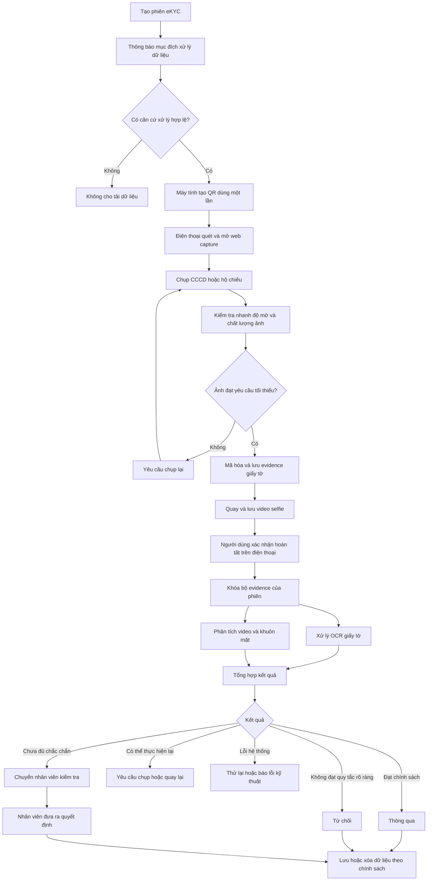
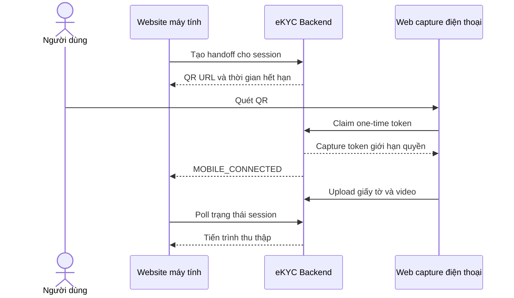
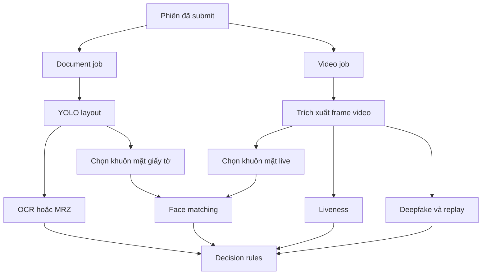

# Thiết kế luồng eKYC v2 — Bản dễ hiểu

| Thông tin | Nội dung |
|---|---|
| Trạng thái | Bản nháp để Product, Business, Engineering, Security và Legal/DPO cùng review |
| Phạm vi | Xác minh danh tính bằng CCCD hoặc hộ chiếu và video selfie |
| Bản kỹ thuật chi tiết | [Tài liệu thiết kế luồng eKYC v2](./EKYC_FLOW_DESIGN.md) |
| Tài liệu nguồn | [Checklist bảo mật và tuân thủ](./EKYC_SECURITY_COMPLIANCE_CHECKLIST.md), [Kế hoạch migration v2](./EKYC_V2_MIGRATION_PLAN.md) |

> Đây là tài liệu giải thích cách hệ thống dự kiến hoạt động. Những nội dung liên
> quan đến căn cứ xử lý dữ liệu, thời gian lưu dữ liệu và quyền của người dùng phải
> được Legal/DPO phê duyệt trước khi áp dụng với dữ liệu thật.

## 1. Hệ thống eKYC dùng để làm gì?

Hệ thống giúp xác minh một người từ xa bằng cách:

1. đọc thông tin trên CCCD hoặc hộ chiếu;
2. yêu cầu người dùng quay video selfie;
3. so sánh khuôn mặt trong video với ảnh trên giấy tờ;
4. kiểm tra người dùng có phải người thật hay có dấu hiệu giả mạo;
5. đưa ra kết quả hoặc chuyển hồ sơ cho nhân viên kiểm tra.

Hệ thống không chỉ cần xử lý chính xác mà còn phải bảo vệ ảnh giấy tờ, video và
thông tin cá nhân trong toàn bộ quá trình.

## 2. Luồng tổng thể



Hiểu ngắn gọn:

```text
Có căn cứ xử lý
→ Máy tính hiển thị QR
→ Điện thoại mở web capture
→ Chụp giấy tờ trên điện thoại
→ Kiểm tra nhanh ảnh có bị mờ không
→ Quay video selfie
→ Người dùng xác nhận hoàn tất
→ OCR giấy tờ và phân tích video bất đồng bộ
→ Tự động quyết định hoặc chuyển nhân viên
→ Xóa dữ liệu khi hết thời hạn
```

## 3. Những nguyên tắc quan trọng

### 3.1 Chưa đủ điều kiện thì không thu thập dữ liệu

Trước khi người dùng tải CCCD, hộ chiếu hoặc video, hệ thống phải:

- thông báo dữ liệu được dùng để làm gì;
- xác định căn cứ xử lý đã được Legal/DPO phê duyệt;
- ghi lại bằng chứng người dùng đã được thông báo;
- kiểm tra hệ thống mã hóa và audit đang hoạt động.

Nếu chưa đáp ứng, hệ thống không được cho phép upload.

### 3.2 Lỗi bảo mật thì phải dừng

Nếu không lấy được khóa mã hóa, không xác thực được service hoặc không ghi được
audit, hệ thống phải dừng thao tác nhạy cảm.

Hệ thống không được:

- lưu tạm CCCD dưới dạng đọc được;
- bỏ qua bước mã hóa;
- cho nhân viên xem dữ liệu khi không ghi được audit;
- tiếp tục xử lý như thể không có lỗi.

### 3.3 Không chắc chắn thì chuyển nhân viên

Hệ thống không được tự đoán thông tin hoặc cố đưa ra kết luận.

Ví dụ cần chuyển nhân viên kiểm tra:

- OCR đọc số giấy tờ không chắc chắn;
- thông tin ở hai mặt CCCD không khớp;
- mã kiểm tra trên hộ chiếu không đạt;
- khuôn mặt có độ tương đồng ở vùng chưa đủ chắc chắn;
- liveness hoặc deepfake model trả kết quả không kết luận được.

### 3.4 Lỗi hệ thống không có nghĩa là gian lận

Nếu model bị lỗi, queue bị gián đoạn hoặc KMS không hoạt động, kết quả phải là lỗi
kỹ thuật. Hồ sơ không được tự động chuyển thành “từ chối” hoặc “gian lận”.

### 3.5 Không sử dụng LLM để ra quyết định

Luồng này không sử dụng LLM để:

- OCR giấy tờ;
- trích xuất trường thông tin;
- đề xuất duyệt hoặc từ chối;
- thay nhân viên kiểm duyệt.

## 4. Ai tham gia vào luồng eKYC?

| Người hoặc thành phần | Trách nhiệm |
|---|---|
| Người dùng | Cung cấp giấy tờ, quay video và theo dõi trạng thái hồ sơ |
| Website trên máy tính | Khởi tạo phiên, hiển thị QR và theo dõi tiến trình |
| Web capture trên điện thoại | Chụp giấy tờ, quay video và submit evidence |
| eKYC API | Quản lý phiên, quyền upload và trạng thái |
| Handoff service | Tạo QR token, liên kết điện thoại với phiên và chống token replay |
| Bộ xử lý giấy tờ | Kiểm tra ảnh, OCR, MRZ và trích xuất khuôn mặt |
| Bộ xử lý biometric | Face matching, liveness và tín hiệu giả mạo |
| Bộ quyết định | Áp dụng các quy tắc đã được phê duyệt |
| Nhân viên kiểm duyệt | Xử lý những trường hợp chưa đủ chắc chắn |
| Bộ phận Security/Legal/DPO | Phê duyệt bảo mật, căn cứ xử lý và lưu trữ dữ liệu |
| Bộ phận vận hành | Theo dõi hệ thống nhưng không mặc định được xem dữ liệu cá nhân |

Mỗi vai trò chỉ được cấp đúng quyền cần thiết. Người quản trị máy chủ không mặc định
có quyền xem CCCD hoặc video của người dùng.

## 5. Bước 1 — Tạo phiên eKYC

Khi bắt đầu, ứng dụng gửi yêu cầu tạo một phiên eKYC.

Hệ thống tạo:

- mã phiên ngẫu nhiên;
- loại giấy tờ dự kiến;
- mục đích xác minh;
- thời gian hết hạn;
- phiên bản chính sách đang áp dụng.

Trạng thái ban đầu là `AWAITING_LAWFUL_BASIS`, nghĩa là hệ thống đang chờ xác nhận
căn cứ xử lý dữ liệu.

Ở bước này, người dùng chưa được cấp quyền tải CCCD hoặc video.

## 6. Bước 2 — Thông báo và căn cứ xử lý dữ liệu

Trước khi thu thập dữ liệu, ứng dụng hiển thị cho người dùng:

- đơn vị nào xử lý dữ liệu;
- dữ liệu được sử dụng cho mục đích gì;
- những loại dữ liệu nào sẽ được thu thập;
- dữ liệu có thể được giữ trong bao lâu;
- người dùng có những quyền gì.

Server ghi lại:

- phiên bản nội dung đã hiển thị;
- ngôn ngữ;
- mục đích xử lý;
- loại dữ liệu;
- thời gian và kênh ghi nhận;
- hành động của người dùng nếu sự đồng ý là căn cứ được áp dụng.

Ứng dụng phía người dùng không được tự chọn căn cứ pháp lý. Server sử dụng cấu hình
đã được Legal/DPO phê duyệt.

Nếu thông tin này thiếu hoặc không hợp lệ, server không cấp quyền upload.

### 6.1 Chuyển phiên sang điện thoại bằng QR

Sau khi có căn cứ xử lý hợp lệ, website trên máy tính yêu cầu backend tạo một QR
handoff. QR mở trực tiếp trang web capture trong trình duyệt điện thoại.

Luồng MVP không yêu cầu người dùng nhập mã xác nhận:

```text
Máy tính hiển thị QR
→ điện thoại quét QR
→ trình duyệt mở trang mobile capture
→ backend xác nhận token dùng một lần
→ cấp capture token giới hạn quyền
→ người dùng bắt đầu chụp giấy tờ
```

Máy tính không kết nối trực tiếp với điện thoại. Cả hai thiết bị đọc và cập nhật
trạng thái qua backend.



QR chỉ chứa một URL với token ngẫu nhiên dùng một lần, ví dụ:

```text
https://verify.example.com/capture?t=<one-time-token>
```

QR không chứa PII, số giấy tờ, access token tài khoản, signed evidence URL hoặc dữ
liệu kết quả.

### 6.2 Vòng đời token QR

Handoff token có vòng đời riêng:

```text
CREATED → CLAIMED → CONSUMED
       ↘ EXPIRED
       ↘ REVOKED
```

Quy tắc:

- token chỉ dùng được một lần và có thời gian sống ngắn;
- backend chỉ lưu hash/HMAC của token, không lưu raw token;
- sau khi claim, QR token bị vô hiệu và được đổi thành capture token khác;
- capture token chỉ có quyền upload evidence và submit đúng phiên;
- capture token không được xem PII, kết quả chi tiết hoặc trang quản trị;
- chỉ một điện thoại được claim một handoff tại một thời điểm;
- tạo QR mới phải revoke QR cũ;
- máy tính có nút tạo lại QR và ngắt kết nối điện thoại;
- QR/capture token không được ghi vào application log, analytics hoặc audit payload.

MVP cho phép vào thẳng web capture mà không nhập mã. Nếu sau này triển khai ở quầy
công cộng hoặc risk assessment yêu cầu mức bảo đảm cao hơn, có thể bổ sung bước xác
nhận thiết bị trên máy tính mà không thay đổi luồng evidence phía sau.

### 6.3 API handoff tối thiểu

| API | Mục đích |
|---|---|
| `POST /v2/ekyc/sessions/{id}/handoffs` | Tạo QR token dùng một lần |
| `POST /v2/ekyc/handoffs/claim` | Điện thoại claim token và nhận capture token |
| `GET /v2/ekyc/sessions/{id}/handoff-status` | Máy tính polling trạng thái |
| `POST /v2/ekyc/sessions/{id}/handoffs/{handoff_id}/revoke` | Ngắt thiết bị hoặc vô hiệu QR |

Các lệnh tạo, claim và revoke phải idempotent. Claim lặp lại cùng token không được
tạo thêm capture session hoặc cho thiết bị thứ hai truy cập.

## 7. Bước 3 — Chụp và tải giấy tờ

Các bước chụp giấy tờ và quay video dưới đây được thực hiện trên web capture trong
trình duyệt điện thoại. Toàn bộ evidence vẫn thuộc cùng `session_id` đã được tạo
trên máy tính; QR không tạo một phiên eKYC mới.

### 7.1 Với CCCD

Hệ thống yêu cầu:

- ảnh mặt trước;
- ảnh mặt sau.

Mỗi ảnh có quyền upload riêng. Quyền tải mặt trước không được dùng để tải mặt sau.

### 7.2 Với hộ chiếu

Phiên bản đầu chỉ yêu cầu trang có:

- ảnh chân dung;
- thông tin cá nhân;
- hai dòng MRZ ở cuối trang.

Hệ thống không yêu cầu “mặt sau hộ chiếu”, trang visa hoặc bìa hộ chiếu.

### 7.3 Kiểm tra file upload

Trước khi lưu, hệ thống kiểm tra:

- quyền upload còn hiệu lực;
- file có thuộc đúng phiên không;
- định dạng và kích thước có hợp lệ không;
- nội dung thật của file có đúng với định dạng khai báo không;
- file có mã độc không;
- dữ liệu có thể được mã hóa hay không.

File không cần thiết hoặc không hợp lệ phải bị từ chối và không được lưu.

### 7.4 Kiểm tra chất lượng nhanh ngay sau khi chụp

Với từng ảnh giấy tờ, hệ thống thực hiện một kiểm tra nhẹ trước khi chấp nhận ảnh:

1. giải mã ảnh trong bộ nhớ;
2. đưa ảnh về kích thước chuẩn;
3. đo độ mờ;
4. kiểm tra ảnh quá tối hoặc quá sáng;
5. kiểm tra độ tương phản và vùng chói lớn;
6. trả kết quả cho người dùng.

Bước này chỉ dùng các phép xử lý ảnh nhẹ bằng OpenCV. Không chạy OCR, YOLO,
InsightFace, LLM hoặc model video.

Nếu ảnh không đạt:

- yêu cầu người dùng chụp lại ngay;
- không chọn ảnh làm evidence chính thức;
- không tạo OCR job;
- xóa bản tạm theo policy.

Nếu ảnh đạt:

- mã hóa và lưu evidence;
- ghi nhận mặt giấy tờ và revision;
- cho phép người dùng chuyển sang bước tiếp theo.

Mục tiêu của bước này là phát hiện sớm lỗi có thể sửa khi người dùng vẫn đang ở màn
hình chụp ảnh. Kết quả không được dùng để khẳng định giấy tờ thật hoặc giả.

## 8. Bước 4 — Quay video và hoàn tất thu thập

Sau khi ảnh giấy tờ đã vượt qua kiểm tra chất lượng nhanh, server tạo một thử thách:

- gắn với đúng phiên;
- chỉ dùng được một lần;
- hết hạn sau thời gian ngắn.

Ứng dụng hướng dẫn người dùng:

- đặt khuôn mặt đúng vị trí;
- bảo đảm đủ ánh sáng;
- thực hiện hành động được yêu cầu;
- quay đủ thời lượng.

Khi upload video, hệ thống chỉ:

- xác thực phiên và quyền upload;
- kiểm tra định dạng, kích thước và thời lượng;
- kiểm tra video có thể mở được và có video track;
- quét mã độc;
- mã hóa và lưu evidence.

Face matching, liveness, deepfake, lip-sync và speech model chưa chạy ở bước upload.
Các model này chỉ chạy sau khi người dùng bấm hoàn tất. Cách này tránh tiêu tốn tài
nguyên cho những phiên người dùng bỏ dở.

Khi người dùng bấm hoàn tất, backend:

1. kiểm tra đã có đủ các evidence bắt buộc;
2. kiểm tra ảnh giấy tờ đã vượt qua quality check;
3. chọn revision hiện hành của từng evidence;
4. khóa bộ evidence để không bị thay đổi trong lúc xử lý;
5. chuyển phiên sang `SUBMITTED`;
6. tạo document job và video job;
7. trả trạng thái `PROCESSING` mà không giữ request chờ model.

## 9. Bước 5 — Xử lý giấy tờ sau khi submit

OCR và các model giấy tờ chưa chạy ngay khi upload. Chúng chỉ chạy bất đồng bộ sau
khi người dùng đã cung cấp đủ evidence và bấm hoàn tất phiên.

Khi đó hệ thống:

1. giải mã ảnh trong phạm vi công việc được cấp quyền;
2. xoay và chỉnh phối cảnh;
3. kiểm tra đầy đủ bố cục, góc giấy tờ và chất lượng;
4. kiểm tra loại giấy tờ có đúng loại người dùng đã chọn không;
5. đọc chữ bằng OCR hoặc đọc MRZ;
6. chuẩn hóa và kiểm tra các trường;
7. lấy ảnh chân dung trên giấy tờ;
8. tạo kết quả và mức độ tin cậy;
9. xóa ảnh hoặc dữ liệu trung gian không cần giữ.

Kết quả của bước này có thể là:

| Kết quả | Ý nghĩa |
|---|---|
| Giấy tờ đạt | Đưa kết quả vào bước tổng hợp |
| Cần chụp lại | Fast check đã bỏ sót lỗi hoặc model phát hiện ảnh/bố cục chưa đạt |
| Cần nhân viên kiểm tra | Đọc được nhưng có thông tin không chắc chắn hoặc xung đột |
| Lỗi kỹ thuật | Hệ thống thử lại; không kết luận giấy tờ giả |

## 10. Cách xử lý CCCD

Với mỗi trường đọc được, hệ thống ghi:

- giá trị;
- độ tin cậy;
- thông tin đến từ mặt trước hay mặt sau;
- kết quả kiểm tra theo rule.

Ví dụ:

| Trường hợp | Cách xử lý |
|---|---|
| Ảnh bị chói | Yêu cầu chụp lại |
| Không đọc được số CCCD | Yêu cầu chụp lại hoặc manual review |
| Hai mặt có thông tin xung đột | Manual review |
| Trường không đọc được | Không tự suy đoán giá trị |
| OCR đọc được đầy đủ | Chỉ có nghĩa là đọc được, chưa đủ để khẳng định giấy tờ thật |

## 11. Cách xử lý hộ chiếu

Hộ chiếu được xử lý theo hướng MRZ-first.

MRZ là hai dòng ký tự ở cuối trang thông tin cá nhân. Mỗi dòng của hộ chiếu TD3 có
44 ký tự.

MRZ thường chứa:

- loại giấy tờ;
- quốc gia cấp;
- họ tên;
- số hộ chiếu;
- quốc tịch;
- ngày sinh;
- giới tính;
- ngày hết hạn;
- các số kiểm tra.

Hệ thống:

1. tìm vùng MRZ;
2. đọc đúng hai dòng;
3. tách các trường thông tin;
4. kiểm tra các số kiểm tra;
5. đọc phần thông tin nhìn thấy trên trang;
6. so sánh hai nguồn thông tin.

| Trường hợp | Cách xử lý |
|---|---|
| MRZ đọc rõ và các số kiểm tra đều đạt | Đưa kết quả vào bước tổng hợp |
| Ảnh bị cắt mất MRZ | Yêu cầu chụp lại |
| Số kiểm tra không đạt | Manual review |
| MRZ khác thông tin nhìn thấy | Manual review |
| Không thuộc loại hộ chiếu được hỗ trợ | Thông báo chưa hỗ trợ hoặc chuyển review theo chính sách |

Hệ thống chưa tuyên bố đọc chip NFC hoặc xác thực hộ chiếu với cơ quan phát hành.

## 12. Bước 6 — Kiểm tra khuôn mặt và người thật

Sau khi người dùng bấm hoàn tất, hệ thống khóa các evidence revision được chọn và
tạo video-processing job bất đồng bộ. Job có thể thực hiện:

- kiểm tra chất lượng video và khuôn mặt;
- phát hiện và căn chỉnh khuôn mặt;
- so sánh với ảnh trên giấy tờ;
- kiểm tra liveness;
- kiểm tra tín hiệu deepfake hoặc spoof;
- kiểm tra voice spoof nếu audio thuộc phạm vi được phê duyệt.

Mỗi kết quả phải ghi:

- phiên bản model;
- điểm số hoặc độ tin cậy;
- ngưỡng áp dụng;
- lý do;
- phiên bản quy tắc.

Ảnh mặt cắt ra, frame video, audio và face embedding mặc định được xóa sau xử lý.

Nếu model trả `INCONCLUSIVE`, nghĩa là chưa đủ dữ liệu để kết luận. Nó không có
nghĩa người dùng đang gian lận.

### 12.1 Công việc của từng thuật toán và model

Đây là cách phân công trách nhiệm theo thiết kế đích. Bảng không khẳng định tất cả
model hiện tại đã đạt benchmark production. Các thành phần ghi “nếu được bật” hoặc
“nếu được duyệt” không phải dependency bắt buộc của quyết định eKYC.

| Thời điểm | Thuật toán/model | Dữ liệu đầu vào | Công việc | Kết quả đầu ra |
|---|---|---|---|---|
| Ngay sau khi chụp giấy tờ | OpenCV quality check | Một ảnh giấy tờ | Đo blur, sáng/tối, tương phản và vùng chói | Điểm chất lượng và yêu cầu chụp lại nếu cần |
| Sau khi submit | YOLO layout CCCD | Ảnh CCCD | Tìm bố cục, vùng thông tin, ảnh chân dung và góc giấy tờ | Danh sách vùng cần OCR và cảnh báo bố cục |
| Sau khi submit | MRZ locator | Trang dữ liệu cá nhân hộ chiếu | Tìm đúng vùng hai dòng MRZ | Ảnh vùng MRZ và cảnh báo khi bị cắt/không tìm thấy |
| Sau khi submit | RapidOCR/PP-OCR | Toàn ảnh hoặc vùng YOLO đã cắt | Nhận dạng chữ và confidence | Raw OCR text, bounding box và confidence |
| Sau khi submit | MRZ parser và check-digit rules | Hai dòng MRZ hộ chiếu | Tách trường và kiểm tra số kiểm tra | Trường hộ chiếu, lỗi check digit và xung đột |
| Sau khi submit | CCCD parser và validation rules | OCR hai mặt CCCD | Chuẩn hóa trường và đối chiếu hai mặt | Structured fields và reason codes |
| Sau khi submit | SCRFD/InsightFace detection | Ảnh giấy tờ và các frame video | Tìm khuôn mặt và landmark | Khuôn mặt tốt nhất, bounding box và chất lượng |
| Sau khi submit | ArcFace/InsightFace recognition | Khuôn mặt giấy tờ và video đã căn chỉnh | Tạo embedding và tính độ tương đồng | Face-match score và vùng quyết định |
| Sau khi submit | MiniFASNet | Khuôn mặt từ frame video | Kiểm tra passive liveness/anti-spoof | Liveness score và trạng thái đạt/chưa đạt |
| Sau khi submit | Active-liveness rules | Chuỗi landmark/frame theo thời gian | Kiểm tra chớp mắt hoặc quay đầu theo challenge | Kết quả từng challenge |
| Sau khi submit | Deepfake ONNX model | Các face frame được chọn | Tìm tín hiệu hình ảnh giả hoặc đã chỉnh sửa | Deepfake score theo frame và kết quả tổng hợp |
| Sau khi submit | Replay/camera heuristics | Chuỗi frame và metadata video | Tìm frame lặp, hình ảnh đóng băng hoặc dấu hiệu phát lại | Replay/camera-injection reason codes |
| Sau khi submit, nếu được bật | SyncNet/lip-sync | Face track và audio | Kiểm tra chuyển động môi có khớp âm thanh không | Lip-sync score |
| Sau khi submit, nếu được duyệt | Whisper/PhoWhisper | Audio từ video | Nhận dạng nội dung challenge bằng giọng nói | Transcript tạm thời và mức độ khớp |
| Khi đủ kết quả | Decision rules | Các signal đã chuẩn hóa | Áp dụng policy và reason code | Approve, reject, review hoặc resubmission |

Decision rules không phải model AI. Thành phần này chỉ áp dụng các ngưỡng và quy
tắc đã được phê duyệt lên kết quả của các model.

### 12.2 Quan hệ phụ thuộc giữa các model

Các công việc không hoàn toàn phải chạy nối tiếp:



Document job và video job có thể chạy song song. Face matching chỉ chạy khi đã có
khuôn mặt từ cả giấy tờ và video. Decision chỉ chạy khi các signal bắt buộc đã đủ.

### 12.3 Điều không được suy diễn từ kết quả model

- Blur score thấp chỉ có nghĩa ảnh chưa phù hợp để xử lý, không có nghĩa giấy tờ giả.
- OCR đọc đủ chữ không chứng minh giấy tờ thật.
- Face-match score thấp không tự chứng minh một người gian lận.
- Liveness hoặc deepfake `INCONCLUSIVE` phải chuyển review hoặc yêu cầu làm lại.
- Có file model trong hệ thống không đồng nghĩa model đã đạt benchmark production.

### 12.4 Quy tắc vận hành model

- Tất cả model bắt buộc phải được tải, kiểm tra checksum và đặt sẵn trước khi worker
  nhận job.
- Production worker không được tự tải model từ Internet trong lúc xử lý hồ sơ.
- Mỗi worker load model một lần khi khởi động và tái sử dụng cho nhiều job.
- Worker chỉ chuyển sang trạng thái ready sau khi các model bắt buộc vượt qua smoke
  test.
- Mỗi kết quả phải ghi model version, rule version và threshold version.
- Thiếu model bắt buộc phải làm job dừng với lỗi kỹ thuật, không fallback sang một
  phương pháp yếu hơn mà không có phê duyệt.

## 13. Bước 7 — Tổng hợp kết quả

Bộ quyết định nhận các kết quả đã chuẩn hóa, không cần nhận ảnh hoặc video gốc.

Nó có thể trả một trong các kết quả:

| Kết quả | Ý nghĩa |
|---|---|
| `APPROVED` | Hồ sơ đạt chính sách đang áp dụng |
| `REJECTED` | Hồ sơ không đạt một quy tắc từ chối rõ ràng đã được phê duyệt |
| `MANUAL_REVIEW` | Cần nhân viên kiểm tra |
| `RESUBMISSION_REQUIRED` | Người dùng cần chụp hoặc quay lại |
| `UNABLE_TO_COMPLETE` | Không thể hoàn tất do lỗi hoặc hành trình bị gián đoạn |

Nguyên tắc routing:

- tất cả kiểm tra đạt → có thể thông qua tự động;
- vi phạm quy tắc từ chối rõ ràng → có thể từ chối tự động;
- độ tin cậy thấp hoặc tín hiệu xung đột → manual review;
- ảnh/video có thể cải thiện → yêu cầu thực hiện lại;
- model, mã hóa, lưu trữ hoặc audit bị lỗi → lỗi kỹ thuật.

## 14. Bước 8 — Nhân viên kiểm duyệt

Nhân viên chỉ xử lý những hồ sơ chưa đủ chắc chắn hoặc policy yêu cầu con người
kiểm tra.

Quy trình:

1. nhân viên đăng nhập bằng MFA;
2. danh sách hồ sơ mặc định che thông tin cá nhân;
3. nhân viên chỉ mở những trường cần thiết;
4. mỗi lần xem hoặc giải mã đều được ghi audit;
5. nhân viên chọn duyệt, từ chối, yêu cầu làm lại hoặc chuyển cấp cao hơn;
6. trường hợp từ chối hoặc yêu cầu làm lại phải có lý do;
7. kết quả tự động ban đầu không bị sửa hoặc xóa.

Nếu hệ thống audit không hoạt động, nhân viên không được xem dữ liệu hoặc ghi quyết
định.

## 15. Trạng thái của một phiên eKYC

Để dễ quản lý, hệ thống tách ba loại trạng thái.

### 15.1 Người dùng đang ở bước nào?

| Trạng thái | Ý nghĩa |
|---|---|
| `AWAITING_LAWFUL_BASIS` | Chờ xác nhận căn cứ xử lý |
| `AWAITING_DEVICE_HANDOFF` | Máy tính đang hiển thị QR và chờ điện thoại kết nối |
| `COLLECTING_EVIDENCE` | Đang chụp giấy tờ và quay video |
| `SUBMITTED` | Người dùng đã hoàn tất và bộ evidence đã được khóa |
| `PROCESSING` | Document job và video job đang chạy bất đồng bộ |
| `AWAITING_REVIEW` | Đang chờ nhân viên kiểm tra |
| `AWAITING_RESUBMISSION` | Chờ người dùng thực hiện lại |
| `COMPLETED` | Đã có kết quả cuối |
| `EXPIRED` | Phiên đã hết hạn |
| `RESTRICTED` | Tạm dừng do yêu cầu về dữ liệu hoặc tuân thủ |
| `PURGED` | Dữ liệu thuộc phạm vi xóa đã được xóa |

Mỗi evidence có trạng thái riêng:

```text
Giấy tờ:
UPLOADED → QUALITY_CHECKING → QUALITY_PASSED hoặc QUALITY_FAILED

Video:
UPLOADED → STORED → PROCESSING → PROCESSED

QR handoff:
CREATED → CLAIMED → CONSUMED
       ↘ EXPIRED hoặc REVOKED
```

### 15.2 Công việc kỹ thuật đang chạy thế nào?

```text
Đang chờ → Đang chạy → Thành công
                   ↘ Chờ thử lại → Thất bại cuối
```

### 15.3 Kết luận nghiệp vụ là gì?

```text
Chưa có kết quả
Thông qua
Từ chối
Cần nhân viên kiểm tra
Cần thực hiện lại
Không thể hoàn tất
```

Việc tách ba nhóm trạng thái giúp lỗi server không bị hiểu nhầm là hồ sơ bị từ chối.

## 16. Dữ liệu được lưu như thế nào?

### 16.1 Database vận hành

Chỉ nên lưu:

- mã phiên;
- trạng thái;
- thời gian;
- phiên bản policy;
- mã tham chiếu.

Không lưu trực tiếp họ tên, số CCCD, ngày sinh, địa chỉ hoặc raw OCR.

### 16.2 Kho dữ liệu nhạy cảm

Kho mã hóa lưu:

- ảnh CCCD hoặc hộ chiếu;
- video selfie;
- thông tin định danh cần giữ;
- kết quả phân tích đầy đủ.

Mỗi dữ liệu phải có mục đích và thời hạn lưu.

### 16.3 Dữ liệu chỉ nên tồn tại tạm thời

Mặc định xóa sau xử lý:

- raw OCR;
- ảnh khuôn mặt được cắt ra;
- frame video;
- audio trung gian;
- face embedding;
- file tạm.

## 17. Mã hóa dữ liệu

Hiểu đơn giản:

1. mỗi file hoặc payload được mã hóa bằng một khóa dữ liệu;
2. khóa dữ liệu tiếp tục được bảo vệ bởi hệ thống quản lý khóa;
3. database không lưu khóa giải mã thực tế;
4. service chỉ được giải mã đúng dữ liệu cần thiết trong thời gian ngắn.

Nếu không thể mã hóa:

1. không lưu dữ liệu;
2. dừng công việc;
3. xóa file tạm;
4. phát cảnh báo không chứa thông tin cá nhân;
5. không chuyển sang lưu plaintext.

## 18. Audit và log

### 18.1 Audit ghi lại hoạt động nhạy cảm

Audit phải trả lời được:

- ai đã tạo hoặc thay đổi phiên;
- ai đã xem hay giải mã thông tin;
- ai đã tải xuống hoặc xuất dữ liệu;
- model, rule và policy nào đã được sử dụng;
- ai đã duyệt hoặc từ chối;
- dữ liệu đã được xóa khi nào.

### 18.2 Log kỹ thuật không được chứa

- ảnh giấy tờ hoặc khuôn mặt;
- video và audio;
- raw OCR;
- họ tên, số giấy tờ, ngày sinh hoặc địa chỉ;
- face embedding;
- password, token, API key hoặc encryption key;
- signed URL;
- request body chứa thông tin cá nhân.

## 19. Thời gian lưu và xóa dữ liệu

Thời gian cụ thể chưa được đặt trong tài liệu vì cần Legal/DPO và business phê duyệt.

Cần quyết định riêng cho:

- hồ sơ đã thông qua;
- hồ sơ bị từ chối;
- hồ sơ bỏ dở hoặc hết hạn;
- hồ sơ có tranh chấp;
- ảnh giấy tờ;
- video và audio;
- thông tin đã trích xuất;
- audit và backup.

Khi đến thời điểm xóa, hệ thống phải kiểm tra và xóa khỏi:

- database;
- object storage;
- file tạm;
- cache;
- queue;
- kết quả trung gian;
- search index;
- backup khi đến thời điểm hết hạn.

Sau khi xóa, hệ thống tạo báo cáo để xác nhận dữ liệu nào đã xóa và bản backup còn
lại sẽ hết hạn khi nào.

## 20. Quyền của người dùng đối với dữ liệu

Tùy quy định áp dụng, hệ thống cần hỗ trợ quy trình:

- yêu cầu xem dữ liệu;
- yêu cầu sửa dữ liệu;
- hạn chế xử lý;
- phản đối hoặc rút lại sự đồng ý khi áp dụng;
- yêu cầu xóa dữ liệu.

Mỗi yêu cầu phải:

- xác thực đúng người yêu cầu;
- có mã hồ sơ và người chịu trách nhiệm;
- được ghi audit;
- không ghi đè bằng chứng hoặc kết quả cũ;
- trả dữ liệu qua kênh an toàn.

## 21. Xử lý sự cố

Hệ thống cần phát hiện:

- một tài khoản xem quá nhiều hồ sơ;
- xuất dữ liệu bất thường;
- cố tăng quyền;
- sử dụng khóa sai mục đích;
- kho lưu trữ bị mở công khai;
- audit ngừng hoạt động;
- thay đổi model hoặc policy trái phép;
- số lần thử biometric bất thường.

Khi có sự cố:

1. cô lập thành phần bị ảnh hưởng;
2. thu hồi token và tài khoản liên quan;
3. đổi khóa nếu cần;
4. bảo toàn bằng chứng;
5. xác định dữ liệu và người dùng bị ảnh hưởng;
6. khôi phục từ bản sạch;
7. Legal/DPO và Security quyết định việc thông báo;
8. theo dõi hành động khắc phục.

## 22. Kiểm thử trước khi sử dụng dữ liệu thật

Các kiểm thử bắt buộc gồm:

- không tìm thấy thông tin cá nhân dạng plaintext;
- thiếu hoặc sai khóa thì không lưu được dữ liệu;
- thiếu căn cứ xử lý thì không upload được;
- audit lỗi thì không xem hoặc giải mã được;
- purge xóa được dữ liệu ở mọi nơi;
- CCCD thiếu mặt được xử lý đúng;
- hộ chiếu sai trang bị từ chối;
- MRZ sai số kiểm tra được chuyển review;
- ảnh mờ được yêu cầu chụp lại;
- QR hết hạn hoặc đã dùng không claim lại được;
- hai điện thoại không thể đồng thời claim cùng một QR;
- tạo QR mới làm QR cũ mất hiệu lực;
- capture token không xem được PII hoặc hồ sơ khác;
- refresh trình duyệt điện thoại không tạo evidence hoặc processing job trùng;
- máy tính đóng sau khi điện thoại đã claim không làm mất phiên đang thu thập;
- mất mạng khi upload video không buộc người dùng chụp lại giấy tờ;
- tín hiệu biometric không chắc chắn được chuyển review;
- lỗi hệ thống không biến thành kết luận gian lận;
- reviewer không có quyền thì không xem được hồ sơ.

Model cũng phải được kiểm thử về:

- độ chính xác OCR;
- độ chính xác MRZ;
- tỷ lệ nhận nhầm và từ chối nhầm khuôn mặt;
- khả năng phát hiện spoof;
- hiệu năng trên các nhóm người dùng khác nhau.

## 23. Kế hoạch triển khai

### Giai đoạn 0 — Chốt phạm vi

- Chọn sửa dự án hiện tại hay tạo repository mới.
- Chỉ định người chịu trách nhiệm.
- Chốt loại giấy tờ, quốc gia và nhóm người dùng.

### Giai đoạn 1 — Xây nền tảng bảo mật

- Xác định căn cứ xử lý và thời gian lưu.
- Xây kho mã hóa.
- Tích hợp quản lý khóa.
- Xây audit và purge.
- Xây QR handoff token dùng một lần, hết hạn và revoke.
- Xây trang web capture dành cho trình duyệt điện thoại.

### Giai đoạn 2 — Xử lý CCCD

- Xây pipeline dùng chung.
- Tách fast quality check khỏi OCR và YOLO.
- Bổ sung OCR và rule cho CCCD.
- Không sử dụng LLM.

### Giai đoạn 3 — Xử lý hộ chiếu

- Hỗ trợ hộ chiếu TD3.
- Đọc MRZ.
- Kiểm tra số kiểm tra và so sánh thông tin.

### Giai đoạn 4 — Biometric

- Face matching.
- Liveness.
- Deepfake/spoof signal.
- Kiểm thử ngưỡng và hiệu năng trên các nhóm người dùng.

### Giai đoạn 5 — Sẵn sàng production

- Đóng gói model trước khi chạy và kiểm tra worker warm-up/readiness.
- Load test document worker và video worker theo công suất mục tiêu.
- Penetration test.
- Kiểm thử xóa dữ liệu.
- Diễn tập sự cố.
- Thử khôi phục backup.
- Security, Legal/DPO và system owner phê duyệt.

## 24. Những nội dung cần được quyết định

Trước khi triển khai production, các bên liên quan phải trả lời:

1. Mục đích chính xác của eKYC là gì?
2. Hỗ trợ người dùng và quốc gia nào?
3. Hỗ trợ những loại CCCD và hộ chiếu nào?
4. Thông tin nào cần giữ lại sau khi xác minh?
5. Ảnh và video được lưu trong bao lâu?
6. Có thực sự cần giữ face embedding không?
7. Dữ liệu, backup và monitoring được đặt tại region nào?
8. Ngưỡng OCR, face matching và liveness là bao nhiêu?
9. Trường hợp nào được duyệt hoặc từ chối tự động?
10. Trường hợp nào bắt buộc nhân viên kiểm tra?
11. Ai được quyền xem, giải mã, sửa, xuất hoặc xóa dữ liệu?
12. Người dùng được chụp hoặc quay lại bao nhiêu lần?
13. QR token, capture token và phiên mobile được phép tồn tại trong bao lâu?

Không nên tự đặt các giá trị này trong code khi chưa có phê duyệt.

## 25. Điều kiện trước khi bật production

Không sử dụng dữ liệu thật nếu chưa hoàn thành các yêu cầu P0.

Không bật production nếu chưa có:

- mục đích và căn cứ xử lý được phê duyệt;
- thông báo cho người dùng;
- chính sách thời gian lưu;
- mã hóa và quản lý khóa;
- phân quyền và MFA;
- audit cho mọi hành động nhạy cảm;
- QR token dùng một lần, hết hạn, revoke và chống replay hoạt động đúng;
- quy trình xóa dữ liệu đầy đủ;
- danh sách nơi dữ liệu được lưu hoặc truyền tới;
- kiểm thử model và threshold;
- penetration test;
- diễn tập sự cố và khôi phục backup;
- phê duyệt của Security, Legal/DPO và system owner.

## 26. Giải thích thuật ngữ

| Thuật ngữ | Giải thích đơn giản |
|---|---|
| eKYC | Xác minh danh tính điện tử |
| OCR | Công nghệ đọc chữ từ ảnh |
| MRZ | Hai dòng ký tự máy đọc được trên hộ chiếu |
| Check digit | Số dùng để kiểm tra một trường trong MRZ có được đọc hợp lệ không |
| Biometric | Dữ liệu sinh trắc học, trong luồng này chủ yếu là khuôn mặt và giọng nói nếu áp dụng |
| Face matching | So sánh khuôn mặt trong video với ảnh trên giấy tờ |
| Liveness | Kiểm tra người trước camera có phải người thật đang hiện diện không |
| Spoof | Hành vi giả mạo bằng ảnh, video phát lại, mặt nạ hoặc phương pháp khác |
| Deepfake | Nội dung hình ảnh, video hoặc âm thanh được tạo/chỉnh sửa bằng AI |
| Confidence | Mức độ chắc chắn của kết quả |
| Manual review | Nhân viên kiểm tra hồ sơ |
| QR handoff | Cơ chế chuyển bước thu thập của cùng một phiên từ máy tính sang điện thoại |
| Handoff token | Token ngắn hạn dùng một lần nằm trong QR để điện thoại nhận phiên |
| Capture token | Token giới hạn quyền để điện thoại upload evidence và submit phiên |
| PII | Thông tin có thể xác định một cá nhân |
| Plaintext | Dữ liệu có thể đọc trực tiếp vì chưa được mã hóa |
| KMS/HSM | Hệ thống quản lý và bảo vệ khóa mã hóa |
| Audit | Bản ghi ai đã làm gì, vào lúc nào và kết quả ra sao |
| Retention | Thời gian dữ liệu được phép lưu |
| Purge | Xóa dữ liệu khỏi toàn bộ nơi đang lưu |
| Fail closed | Thành phần bảo mật lỗi thì dừng, không bỏ qua kiểm soát |
| MFA | Đăng nhập bằng từ hai yếu tố xác thực trở lên |
| Policy | Bộ chính sách và quy tắc nghiệp vụ đã được phê duyệt |
| Reason code | Mã giải thích vì sao có một kết quả hoặc lỗi |

## 27. Tóm tắt

Toàn bộ thiết kế có thể được ghi nhớ bằng ba nguyên tắc:

1. **Không đủ chắc chắn thì chuyển nhân viên, không tự đoán.**
2. **Lỗi kỹ thuật không có nghĩa người dùng gian lận.**
3. **Không có căn cứ xử lý, mã hóa hoặc audit thì không thu thập dữ liệu thật.**

Luồng cuối cùng:

```text
Thu thập hợp lệ
→ Xử lý an toàn
→ Đưa ra kết quả có giải thích
→ Cho phép nhân viên kiểm tra khi cần
→ Lưu đúng thời hạn
→ Xóa dữ liệu có bằng chứng
```
